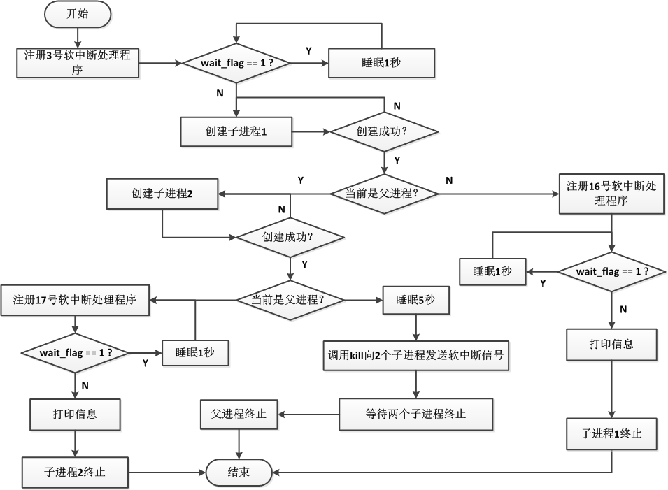
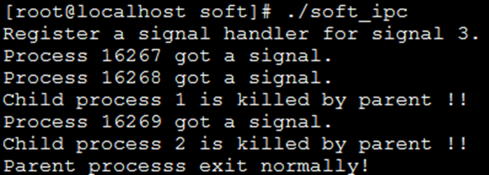
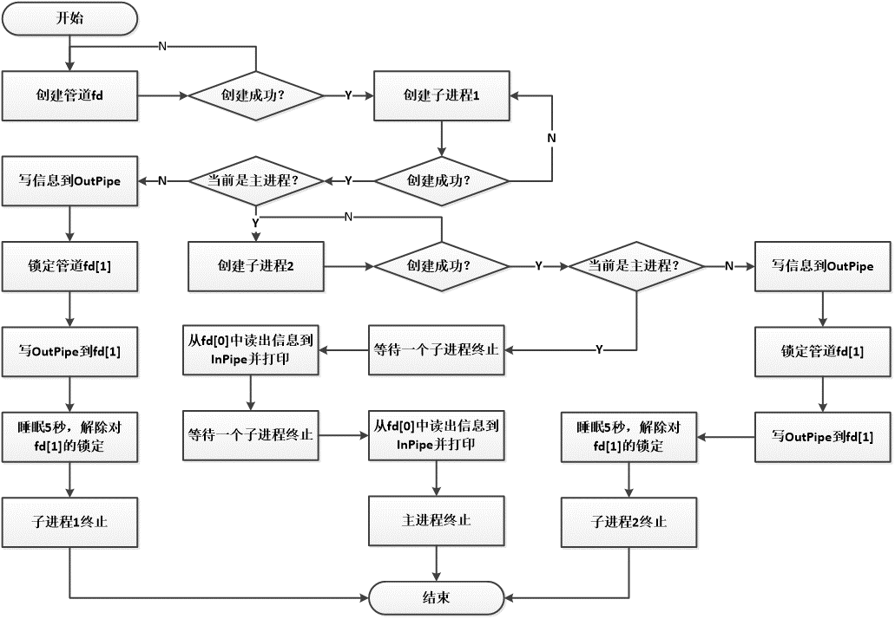
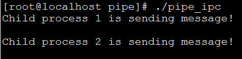

### Linux编程实战：进程管理

#### 实验目的
按要求编写2个C语言程序。

##### 程序1
编制实现软中断通信的程序。父进程fork两个子进程。等待一段时间后，kill子进程形成软中断，并wait函数等待子进程退出信号。

程序1流程图

运行程序soft_ipc，直到输入ctrl+\，产生如下的输出，其中进程的PID和顺序可以不同，但其他输出内容必须一致。

实验代码：
[soft_ipc.c](\lab1\soft_ipc.c)

##### 程序2
编制实现进程的管道通信的程序。父进程开通pipe，并fork两个子进程。接收来自于子进程的信息并输出在Shell里。

程序2流程图

运行pipe_ipc，输出如下所示内容。（注：子进程1和2的输出顺序可以不同。）

实验代码：
[pipe_ipc.c](\lab2\pipe_ipc.c)
