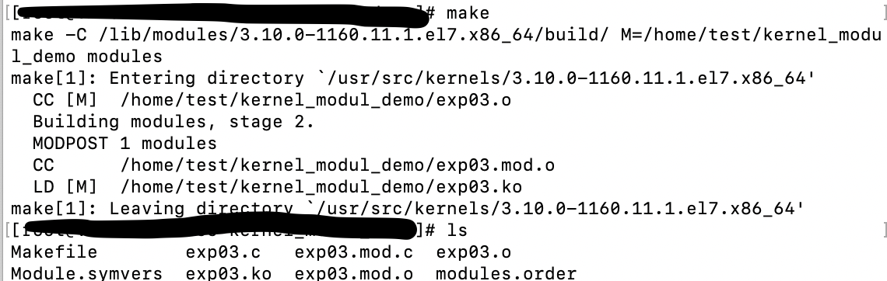
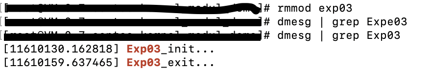

### 实验目的
编写一个内核模块，要求：

（1）编译该模块

（2）加载、卸载该模块

写内核程序需要注意：

内核编程时不能访问C库

内核编程时必须使用GUN C

内核编程时缺乏像用户空间那样的内存保护机制

内核编程时浮点数很难使用

内核只有一个很小的定长堆栈

由于内核支持异步中断、抢占SMP，因此必须时刻注意同步和并发

要考虑可移植性的重要性

### 实验记录
centos 服务器
Linux version 3.10.0-1160.11.1.el7.x86_6

gcc version 4.8.5 20150623

首先切换到root权限，随后编写exp03.c和Makefile

[exp03.c](exp03.c)

[Makefile](Makefile)

执行make命令

安装内核模块exp03.ko，然后在已安装的模块中查找exp03

卸载内核模块exp03.ko，然后使用dmesg查看printk输出的内容

